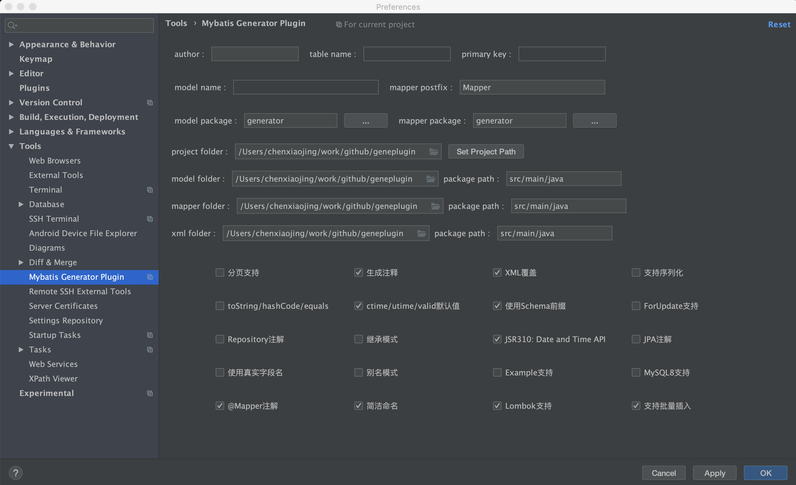
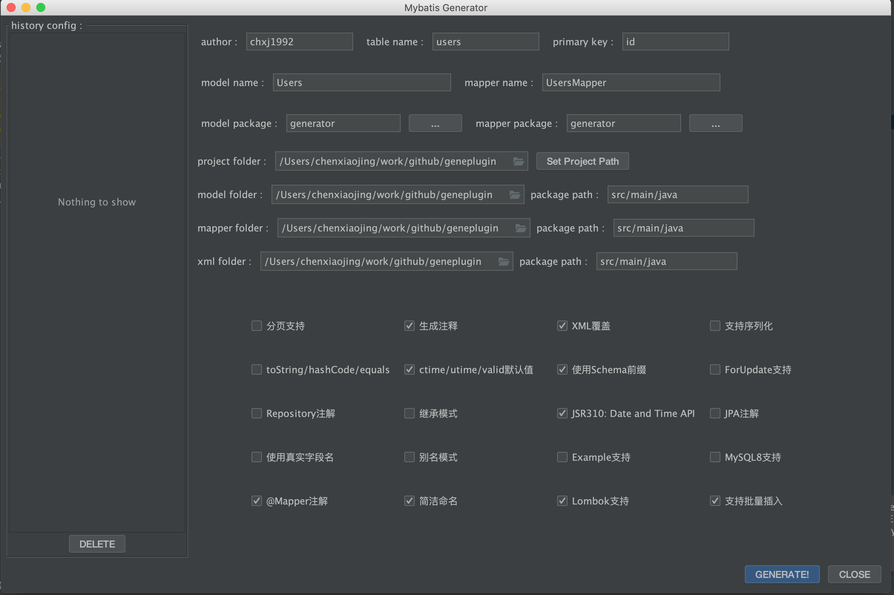

Mybatis Generator Plugin (IDEA Plugin)
====

本插件基于<a href="https://github.com/kmaster/better-mybatis-generator"> better-mybatis-generator </a>二次开发而成. 
在原有功能的基础上增加了对批量插入, JavaDoc注释, @Mapper注解, 方法命名 等做了改造, 使之符合团队的规范要求.

改造点:
------
1. 增加类注释, @author(作者信息), @since(生成时间)支持
2. 增加 @Mapper, @Getter, @Setter, @ToString 注解支持
3. 增加对 batchInsert 方法的支持
4. 支持将方法命名风格从 xxxByPrimaryKey 改为 xxxById
5. 重构代码, 使之对二次开发更友好

插件安装:
-------
- 手动zip安装:
  - 下载 [最新发布版本](https://github.com/chxj1992/mybatis-generator-plugin/raw/master/mybatis-generator-plugin.zip)        
  - 手动安装: <kbd>Preferences</kbd> > <kbd>Plugins</kbd> > <kbd>Install plugin from disk...</kbd>

截图:
-------

1. 设置默认配置  
 

2. 配置数据库  
 
 
 

3. 在需要生成代码的表上右键, 选择 mybatis generator，打开预览界面  
 

4. 设置确认完成后, 点击 `GENERATE!` 开始生成代码 
 

5. 首次使用此插件, 需要为插件提供数据库账号密码  
 

6. 检查生成的代码文件 
 

二次开发:
---------

扩展的 Feature 一般可以通过继承 `PluginAdapter` 定义 Mybatis Generator 插件的方式来实现.
本项目使用到的插件定义在 [mybatis-generator 插件包](https://github.com/chxj1992/geneplugin) 中, 
有兴趣的同学可以前往阅读或修改源码.
 
需要注意的是, 在 IDEA 插件开发时, 需要通过本地导入的方式引入第三方包, 所以需要将修改后的插件包打成 jar 
文件并放在 lib 目录下.

加入新 Feature 时, 需要在 ExtendFeatureEnum 中定义新的枚举项, 并在 Generate.addPluginConfiguration 方法中
定义并引入对应的插件类即可.
